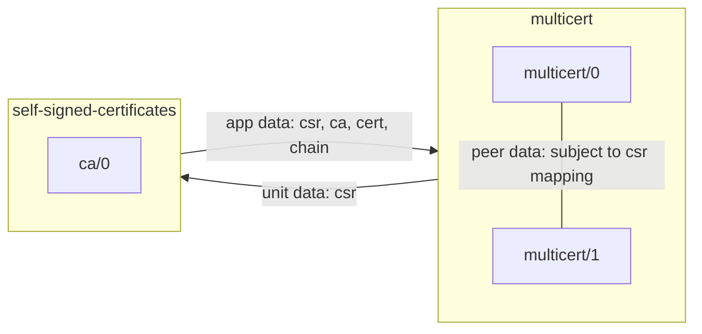

# multicert

This is a manual tester charm for multiple tls certificates.
An attempt at "vectorizing" [tls-certificates-requirer-operator](https://github.com/canonical/tls-certificates-requirer-operator/).

With the tls-certificates interface we send CSRs over unit data, and receive
a cert package (the original csr, ca cert, signed cert and chain) back over app
data.

This charm is an example of how to combine two multiplicities:
1. Scaling the app: every unit has its own set of certs.
2. Multiple certs per unit: the config option takes a comma separated list of
   unique cert subjects.

The cert subject config option + unit name make up the final csr subject
(product of the two multiplicities).



You can give this a try with the following bundle:

```yaml
bundle: kubernetes
applications:
  ca:
    charm: self-signed-certificates
    channel: edge
    revision: 42
    scale: 1
  mc:
    charm: ./multicert_ubuntu-22.04-amd64.charm
    scale: 2
    options:
      cert-subjects: subj3,subj2
relations:
- - ca:certificates
  - mc:certificates
```
